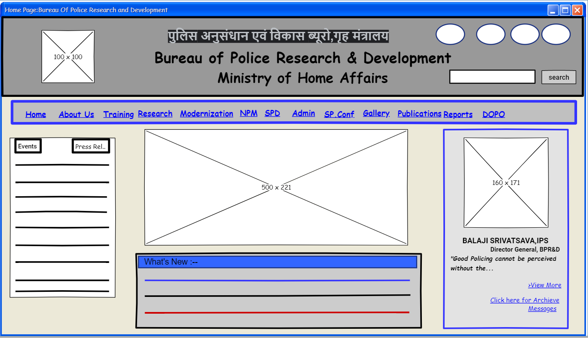
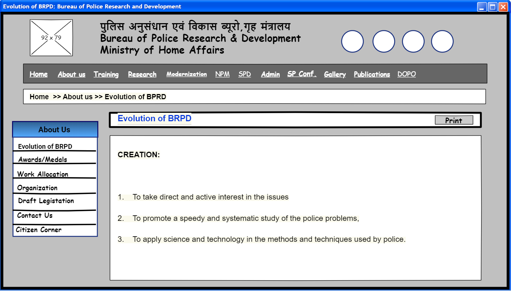
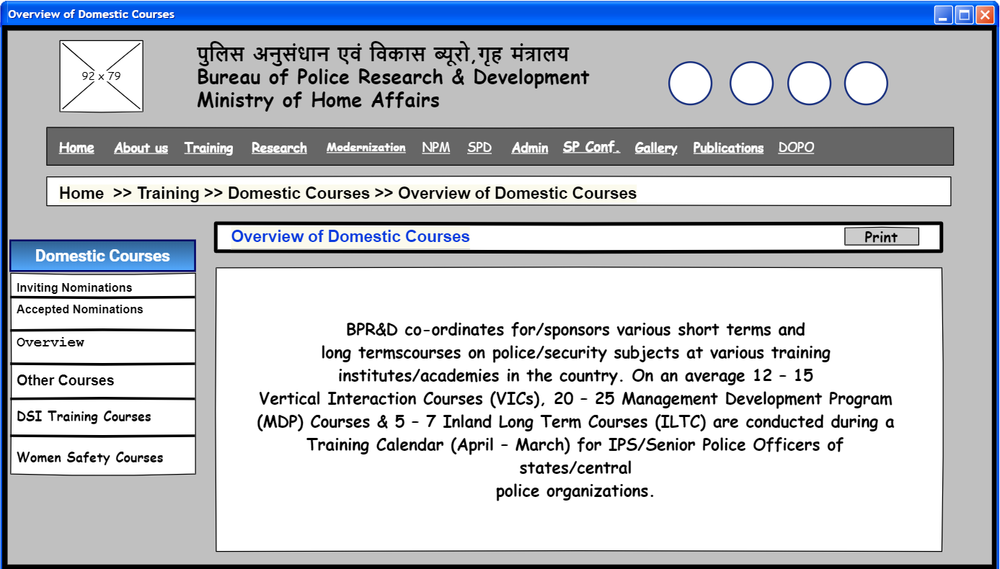

# Wire frame for a website

## AIM:
To design a wire frame for a website.

## DESIGN STEPS:

### Step 1:
Create a New Document.

### Step 2:
Design a wire frame for the given website using the tools.

### Step 3:
Create further webpages and save it in a single document.

### Step 4:
Save the Pages.

## OUTPUT:

### Home Page:

### About:

### Training:

## Result:
Thus a wire frame is designed for a given website.
